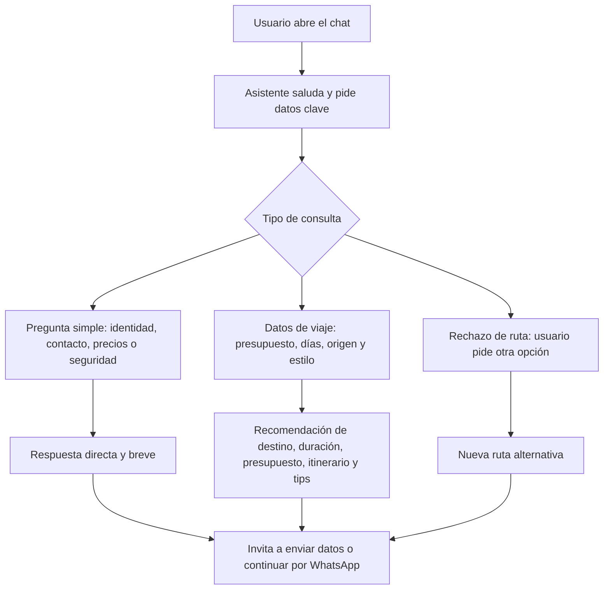

# Caso práctico AI-900: Chatbot Kuntur Travel

## 1. Necesidades del cliente y problemas identificados

Kuntur Travel necesita orientar a visitantes que llegan al sitio con dudas antes de elegir una ruta turística por Perú. En un flujo de e-commerce turístico, el usuario suele abandonar cuando no entiende qué destino elegir, cuánto presupuesto necesita, cuántos días convienen, qué ropa llevar o cómo cerrar una reserva segura.

Problemas identificados:

- Falta de orientación rápida antes de contactar a un asesor.
- Dudas frecuentes sobre presupuesto, duración, clima, seguridad y destinos.
- Riesgo de abandono por exceso de opciones.
- Necesidad de llevar al usuario a WhatsApp con una consulta más ordenada.
- Necesidad de mostrar una experiencia moderna e interactiva dentro del sitio web.

## 2. Diseño del chatbot

El chatbot se llama **Asistente Kuntur** y actúa como asesor turístico digital. Su función es responder preguntas frecuentes, recomendar rutas iniciales y dirigir al usuario a WhatsApp cuando el interés de compra está más claro.

### Preguntas frecuentes cubiertas

- ¿Quién eres y qué haces?
- ¿Qué destinos tienen?
- ¿Cuánto cuesta un viaje?
- ¿Cómo se reserva?
- ¿Es seguro viajar?
- ¿Qué ropa debo llevar?
- ¿Qué ruta recomiendas para pareja, familia o amigos?
- ¿Qué alternativa hay si no me gusta una ruta?
- ¿Cómo contacto a un asesor?

### Flujo conversacional

## 3. Plataformas y frameworks usados

- **Next.js App Router:** permite integrar la landing y la API del chatbot en el mismo proyecto.
- **React + TypeScript:** facilita componentes reutilizables y control de estados del chat.
- **Tailwind CSS:** permite construir una interfaz visual premium y responsive.
- **Vercel:** permite desplegar el sitio web y la API del chatbot rápidamente.
- **API route `/api/chat`:** concentra la lógica del bot y permite cambiar de proveedor sin tocar la interfaz.
- **Fallback local curado:** garantiza que la demo siga funcionando aunque OpenAI, xAI o Groq no tengan cuota disponible.

Justificación: esta arquitectura es simple, demostrable y adecuada para un caso académico porque muestra integración real entre sitio web, interfaz conversacional, lógica de negocio y despliegue web.

## 4. Plan de implementación

1. Levantar la landing de Kuntur Travel con secciones de destinos, paquetes, testimonios y contacto.
2. Crear el componente flotante del chatbot con estado abierto, minimizado y cerrado.
3. Implementar preguntas frecuentes y respuestas curadas para cubrir dudas típicas del usuario.
4. Integrar la ruta `/api/chat` para usar proveedores de IA cuando existan credenciales válidas.
5. Agregar fallback local para evitar fallos por cuota o credenciales durante la presentación.
6. Conectar CTA de WhatsApp para convertir la conversación en una consulta comercial.
7. Verificar la experiencia en desktop y móvil.
8. Subir el proyecto a GitHub sin credenciales privadas.
9. Desplegar en Vercel y configurar variables de entorno privadas si se usan APIs externas.

## 5. Estado del cumplimiento

- Herramientas de desarrollo y sitio web integrado: cumplido.
- Estudio de interacciones y preguntas frecuentes: cubierto mediante FAQ y flujo conversacional.
- Descripción de necesidades y problemas del flujo de e-commerce: cumplido.
- Diseño del chatbot con flujo y mapa conversacional: cumplido.
- Explicación de plataformas y frameworks: cumplido.
- Plan de implementación para integrar el chatbot al sitio: cumplido.

El punto más débil es la IA generativa externa, porque depende de cuotas o permisos de proveedor. Para la demostración, el fallback local curado asegura respuestas consistentes y evita errores en vivo.
